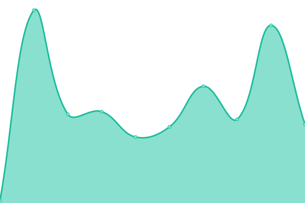

# [📈 Live Status](https://status.aharooms.com): <!--live status--> **🟧 Partial outage**

This repository contains the open-source uptime monitor and status page for [Aharooms](https://status.aharooms.com), powered by [Upptime](https://github.com/upptime/upptime).

With [Upptime](https://upptime.js.org), you can get your own unlimited and free uptime monitor and status page, powered entirely by a GitHub repository. We use [Issues](https://github.com/aharooms/status/issues) as incident reports, [Actions](https://github.com/aharooms/status/actions) as uptime monitors, and [Pages](https://status.aharooms.com) for the status page.

<!--start: status pages-->
<!-- This summary is generated by Upptime (https://github.com/upptime/upptime) -->
<!-- Do not edit this manually, your changes will be overwritten -->
<!-- prettier-ignore -->
| URL | Status | History | Response Time | Uptime |
| --- | ------ | ------- | ------------- | ------ |
|  [Aharooms](https://www.aharooms.com) | 🟩 Up | [aharooms.yml](https://github.com/aharooms/upptime/commits/HEAD/history/aharooms.yml) | 

 1044ms
     
 | 

<a href="https://status.aharooms.com/history/aharooms">100.00%</a>
    

|  [Aharooms Admin](https://admin.aharooms.com) | 🟩 Up | [aharooms-admin.yml](https://github.com/aharooms/upptime/commits/HEAD/history/aharooms-admin.yml) | 

 44ms
     
 | 

<a href="https://status.aharooms.com/history/aharooms-admin">85.42%</a>
    

|  [PMS Aharooms](https://pms.aharooms.com) | 🟩 Up | [pms-aharooms.yml](https://github.com/aharooms/upptime/commits/HEAD/history/pms-aharooms.yml) | 

 411ms
     
 | 

<a href="https://status.aharooms.com/history/pms-aharooms">100.00%</a>
    

|  [Metabase](https://metabase.aharooms.com) | 🟩 Up | [metabase.yml](https://github.com/aharooms/upptime/commits/HEAD/history/metabase.yml) | 

 99ms
     
 | 

<a href="https://status.aharooms.com/history/metabase">99.16%</a>
    

|  [API version 1](https://be.aharooms.com/healthz) | 🟥 Down | [api-version-1.yml](https://github.com/aharooms/upptime/commits/HEAD/history/api-version-1.yml) | 

 48ms
     
 | 

<a href="https://status.aharooms.com/history/api-version-1">0.00%</a>
    

|  [API version 2](https://api.aharooms.com/healthz) | 🟩 Up | [api-version-2.yml](https://github.com/aharooms/upptime/commits/HEAD/history/api-version-2.yml) | 

 47ms
     
 | 

<a href="https://status.aharooms.com/history/api-version-2">100.00%</a>
    

<!--end: status pages-->

[**Visit our status website →**](https://status.aharooms.com)

## 📄 License

- Powered by: [Upptime](https://github.com/upptime/upptime)
- Code: [MIT](./LICENSE) © [Aharooms](https://status.aharooms.com)
- Data in the `./history` directory: [Open Database License](https://opendatacommons.org/licenses/odbl/1-0/)
